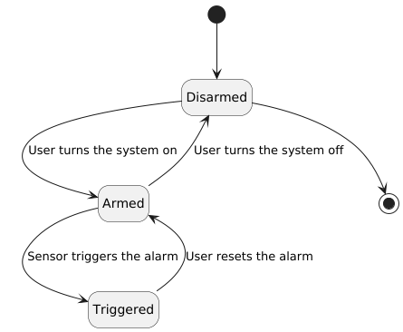
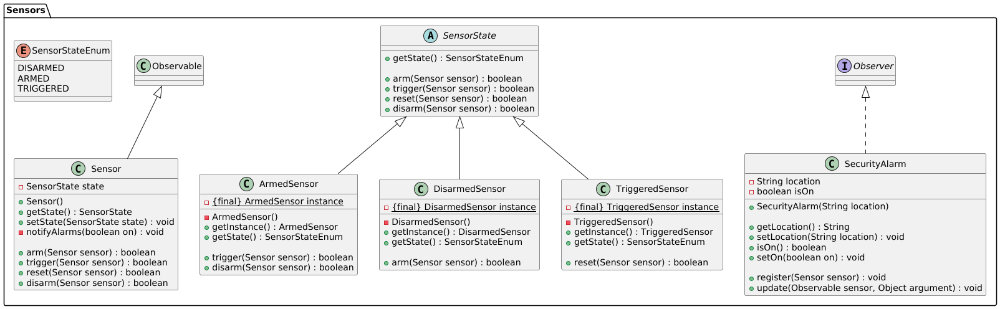

# DCC078 Aspectos Avançados em Engenharia de Software - Observer e State

Atividade realizada para a disciplina **DCC078** Aspectos Avançados em Engenharia de Software.

Este repositório utiliza os padrões Observer e State.

## Diagrama de estado

## Diagrama de classe

