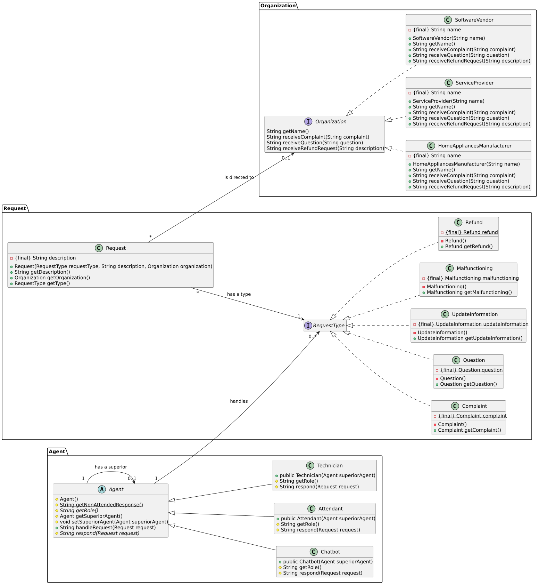

# DCC078 Aspectos Avançados em Engenharia de Software - Chain of Responsibility e Mediator

Atividade realizada para a disciplina **DCC078** Aspectos Avançados em Engenharia de Software.

Este repositório utiliza os padrões Chain of Responsibility e Mediator.

## Diagrama de estado

## Diagrama de classe

